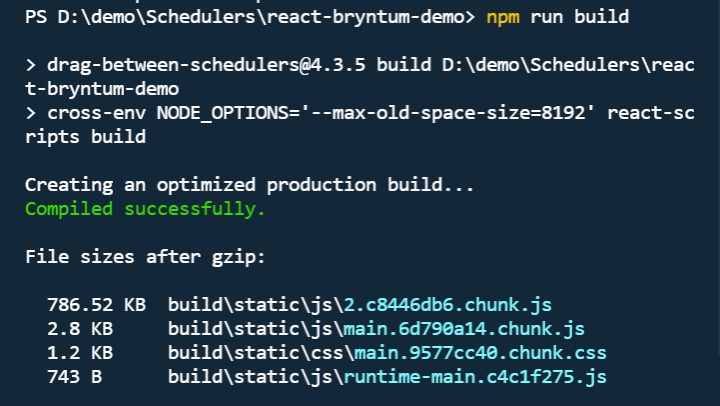
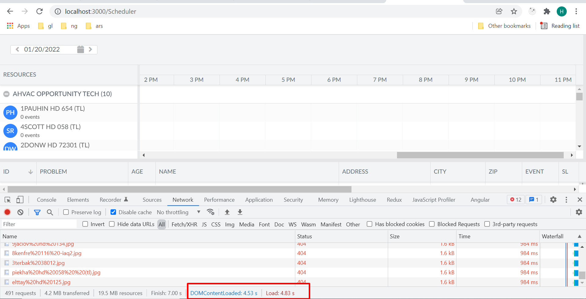
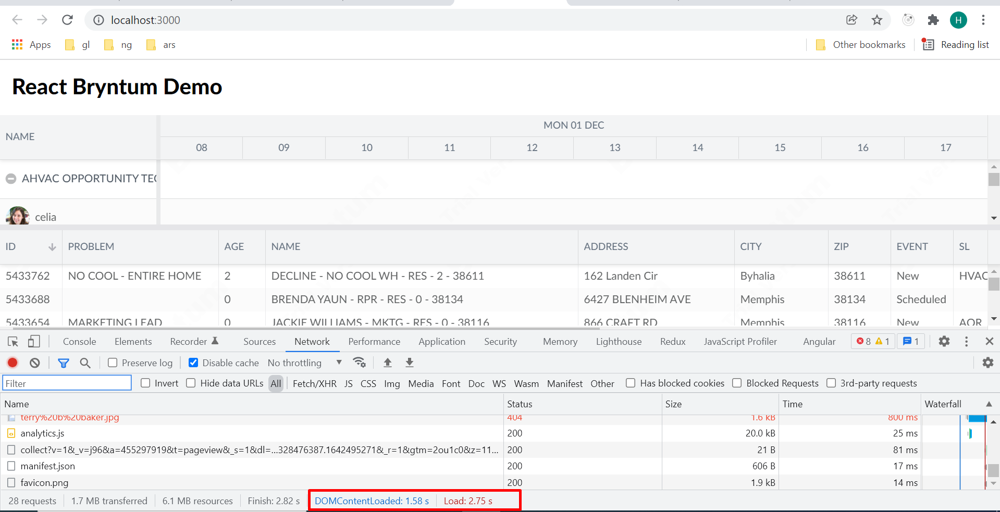

# React + .NET API + Bryntum Schedular

```
npm start
npm run test
npm run build
```

This demo showcase following ....

1. Bryntum integration with React
2. REST API integration
3. Bryntum feature like resources, grid, events, grouping, splitter with React
4. Production build ( very important - as with JS version we might have to handle it that's complex task )



5. Preformance

With JS ( not optimized )



With React ( prod build )


